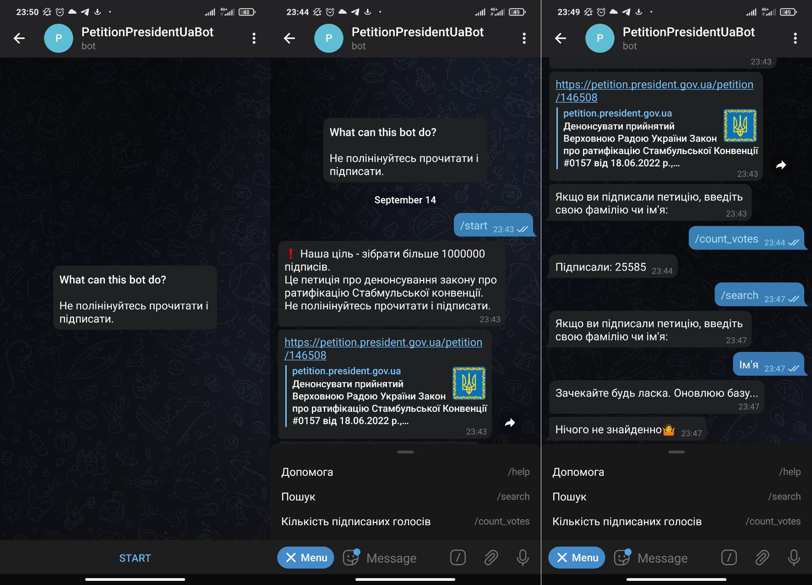

## Telegram Bot



## Additional Information
1. How to get bot token: open Telegram --> Search: BotFather --> /token
2. Telegram Bot API https://core.telegram.org/bots/api
3. C++14 library for Telegram bot API https://github.com/reo7sp/tgbot-cpp

## How to build (Ubuntu 20.04) (Qt 5.15.2)
```
sudo apt-get update
sudo apt-get install g++
sudo apt-get install make
sudo apt-get install binutils
sudo apt-get install cmake
sudo apt-get install libssl-dev
sudo apt-get install libboost-system-dev
sudo apt-get install zlib1g-dev
sudo apt-get install curl
sudo apt-get install libcurl4-openssl-dev

git clone <this_repo>
cd <this_repo>
git checkout master
git pull
./configure
mkdir build
cd build
qmake ..
make
```

## Build and Run docker
```
# clone repo
git clone --single-branch --branch master <this_repo>
cd <this_repo>/docker/
# download any version of build (for exemple 1.1.0)
wget https://github.com/Ilya-Songrov/PetitionPresidentUaBot/releases/download/1.1.0/DeployKit_PetitionPresidentUaBot.zip
unzip DeployKit_PetitionPresidentUaBot.zip
rm DeployKit_PetitionPresidentUaBot.zip
# copy needed files
sudo apt install jq -y
cp start_bot_docker.sh DeployKit_PetitionPresidentUaBot/
cat ../Data/GlobalConfig.json | jq '.dbFilePath = "../db/DbPetitionPresidentUaBot.db"' > DeployKit_PetitionPresidentUaBot/GlobalConfig.json
echo <your_token> > DeployKit_PetitionPresidentUaBot/token.txt
# build docker image
sudo docker build  . --tag petition-president-ua-bot
sudo docker image ls
# copy image to remote host 
sudo docker save petition-president-ua-bot > ~/bot-image.tar
scp ~/bot-image.tar <user>@<host>:~/
# run docker on remote host
ssh <user>@<host>
sudo apt-get update -y
sudo apt install docker.io -y
sudo docker load -i ~/bot-image.tar
mkdir ~/petition-president-ua-bot-db
sudo docker run --volume ~/petition-president-ua-bot-db:/bot-folder-inside-docker/db --restart=always --detach petition-president-ua-bot 
sudo docker ps
```


