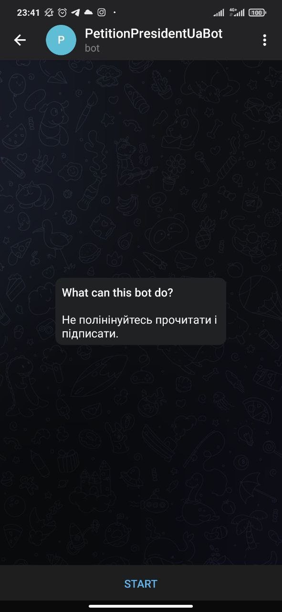

## Telegram Bot

## Additional Information
1. How to get bot token: open Telegram --> Search: BotFather --> /token
2. Telegram Bot API https://core.telegram.org/bots/api
3. C++14 library for Telegram bot API https://github.com/reo7sp/tgbot-cpp

## How to build and run
- Read to build: [build-in-docker](/docker/build-in-docker.md)
- Read to build: [run-in-docker](/docker/run-in-docker.md)

